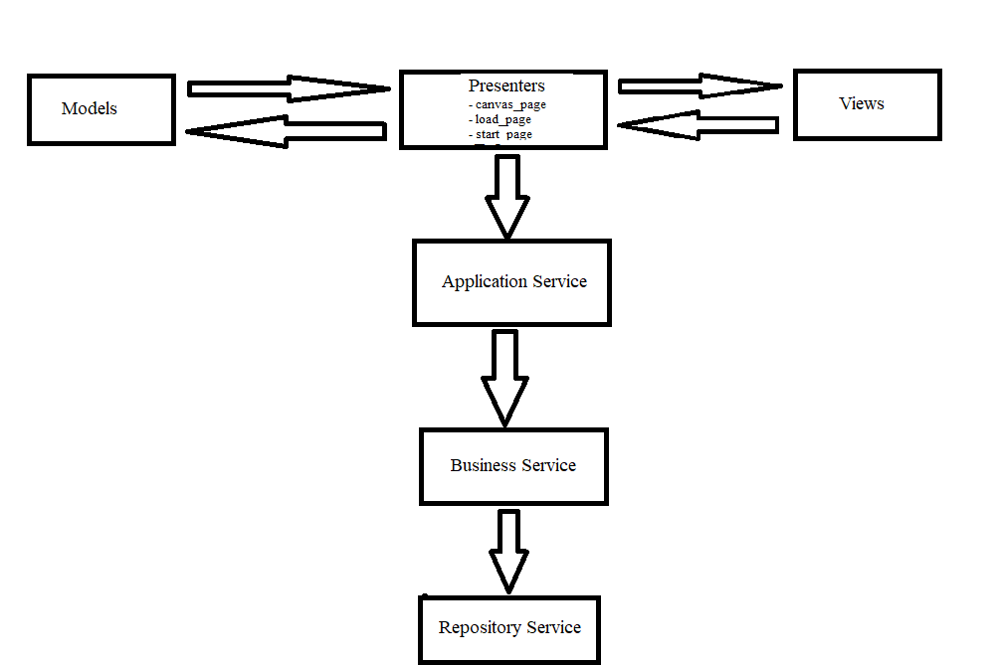

# GraphIt

## General Description

Desktop application that allows you to draw a graph of nodes and edges and will allow you to calculate the most low-cost route from a node to the other node.

Short Description of Technologies
  * Written in Python3 
  * UI using Tkinter
  * Testing with Unitesting
  * Database: SQLite, sqlite3 -DB-API 2.0

### Application Architecture 
- inspired from https://blog.cleancoder.com/uncle-bob/2012/08/13/the-clean-architecture.html
- MVP Pattern used for the Tkinter interface and Business Logic

I used a 3-layered architecture for separating of concerns and for easy testing.

### Project Flow

## Instructions to set up the project environment on Windows
1. Install python3
2. Install virtual environment library: py -m pip install virtualenv
3. Create virtual env folder: py -m venv env
4. cd env/Scripts -> type word activate
5. cd to GraphProject Folder
6. Verify that tkinter is installed: Command py -m tkinter should open a window demonstrating a simple Tk interface, letting you know that tkinter is properly installed on your system
7. Run project: python main.py

## How to interact with the application
* right-click to make a node
* left-click to connect nodes with edges

## How to run tests
1. cd to GraphProject
2. python -m unittest
